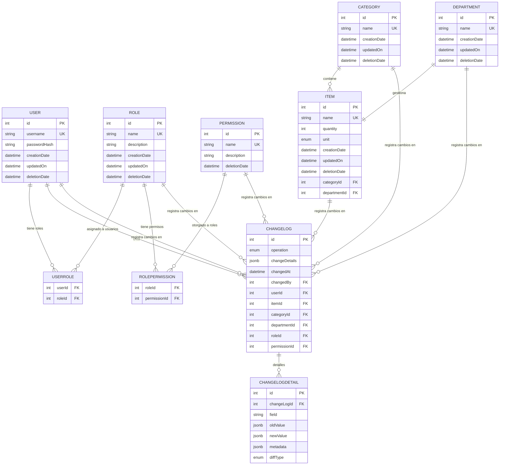

# Gestor de Inventario – Backend

## Descripción General

Este backend es un sistema integral de gestión de inventario construido con **Node.js**, **Express**, **TypeScript** y **Sequelize ORM**. Proporciona una gestión robusta de inventario, categorías y departamentos con una base de datos relacional (PostgreSQL para producción, SQLite para pruebas), con control de acceso basado en roles (RBAC), autenticación JWT y registro de auditoría integral.

### Características Principales

- **Operaciones CRUD Completas** para artículos de inventario, categorías, departamentos, usuarios, roles y permisos
- **Control de Acceso Basado en Roles (RBAC)** con 32 permisos generados automáticamente
- **Autenticación JWT** con hash de contraseñas bcrypt
- **Registro de Auditoría Integral** con seguimiento de cambios a nivel de campo
- **Soporte Multi-Base de Datos** (PostgreSQL/SQLite)
- **API RESTful** con paginación, filtrado y ordenamiento
- **Cobertura de Pruebas Integral** con Jest
- **TypeScript** para seguridad de tipos y mejor experiencia de desarrollo

### Stack Tecnológico

**Dependencias Principales:**

- **Node.js** con framework **Express**
- **TypeScript** para seguridad de tipos
- **Sequelize** con **sequelize-typescript** para ORM
- **PostgreSQL** (producción) / **SQLite** (pruebas)
- **JWT** para autenticación
- **bcrypt** para hash de contraseñas
- **CORS** para compartir recursos de origen cruzado

**Herramientas de Desarrollo:**

- **Jest** para pruebas con **ts-jest**
- **ESLint** con soporte para TypeScript
- **Prettier** para formateo de código
- **ts-node-dev** para recarga en caliente en desarrollo
- **Supertest** para pruebas de API

## Instalación y Configuración

### Prerrequisitos

- **Node.js** (v16 o superior)
- Gestor de paquetes **Yarn**
- **PostgreSQL** (para producción) o **SQLite** (para pruebas)

### Variables de Entorno

Crea un archivo `.env` en el directorio backend con las siguientes variables:

```env
# Configuración de Base de Datos
DB_DIALECT=postgres          # o 'sqlite' para pruebas
DB_HOST=localhost
DB_PORT=5432
DB_NAME=inventory_manager
DB_USER=tu_usuario
DB_PASSWORD=tu_contraseña
DB_STORAGE=:memory:          # Solo para pruebas SQLite

# Configuración JWT
JWT_SECRET=tu-clave-jwt-super-secreta
JWT_EXPIRE_TIME=1h           # Tiempo de expiración del token

# Configuración del Servidor
PORT=4000
BASE_URL=localhost
CORS_ORIGIN=http://localhost:3000

# Entorno
NODE_ENV=development         # o 'production' o 'test'
```

### Pasos de Instalación

1. **Instalar dependencias:**

   ```bash
   yarn install
   ```

2. **Configurar tu base de datos** (PostgreSQL para producción)

3. **Poblar la base de datos con usuario administrador y permisos:**

   ```bash
   yarn db:populate
   ```

4. **Iniciar el servidor de desarrollo:**
   ```bash
   yarn dev
   ```

El servidor se iniciará en `http://localhost:4000` (o tu PORT configurado).

## Scripts Disponibles

- **`yarn dev`** - Iniciar servidor de desarrollo con recarga en caliente usando ts-node-dev
- **`yarn start`** - Iniciar servidor de producción
- **`yarn db:populate`** - Poblar base de datos con usuario administrador y todos los permisos
- **`yarn db:clear`** - Limpiar todos los datos de la base de datos
- **`yarn test`** - Ejecutar suite de pruebas Jest con salida detallada
- **`yarn lint`** - Ejecutar ESLint con auto-corrección para archivos TypeScript

## Modelos y Esquema de Base de Datos

### Modelos Principales

#### **User (Usuario)**

- `id`: entero, PK, auto-incremento
- `username`: cadena, requerido, único
- `passwordHash`: cadena, requerido (hash bcrypt, excluido de consultas por defecto)
- `creationDate`: fecha/hora, automático
- `updatedOn`: fecha/hora, automático
- `deletionDate`: fecha/hora, nullable (eliminación suave)
- **Relaciones**: Muchos-a-muchos con Role vía UserRole
- **Hooks**: Hash de contraseña antes de guardar, registro automático de cambios

#### **Role (Rol)**

- `id`: entero, PK, auto-incremento
- `name`: cadena, requerido, único
- `description`: cadena, opcional
- `creationDate`: fecha/hora, automático
- `updatedOn`: fecha/hora, automático
- `deletionDate`: fecha/hora, nullable (eliminación suave)
- **Relaciones**: Muchos-a-muchos con User y Permission
- **Hooks**: Previene eliminación si hay usuarios asignados, registro automático de cambios

#### **Permission (Permiso)**

- `id`: entero, PK, auto-incremento
- `name`: cadena, requerido, único
- `description`: cadena, requerido
- `deletionDate`: fecha/hora, nullable (eliminación suave)
- **Relaciones**: Muchos-a-muchos con Role vía RolePermission
- **Auto-Generados**: 32 permisos (crear/obtener/editar/eliminar para cada entidad)

#### **Item (Artículo)**

- `id`: entero, PK, auto-incremento
- `name`: cadena, requerido, único
- `quantity`: entero, requerido, por defecto 1, mín 1
- `unit`: enum (`und.`, `kg`, `l`, `m`), requerido, por defecto `und.`
- `creationDate`: fecha/hora, automático
- `updatedOn`: fecha/hora, automático
- `deletionDate`: fecha/hora, nullable (eliminación suave)
- `categoryId`: FK a Category, nullable
- `departmentId`: FK a Department, requerido
- **Relaciones**: Pertenece a Category (opcional) y Department (requerido)
- **Hooks**: Registro automático de cambios en todas las operaciones

#### **Category (Categoría)**

- `id`: entero, PK, auto-incremento
- `name`: cadena, requerido, único
- `creationDate`: fecha/hora, automático
- `updatedOn`: fecha/hora, automático
- `deletionDate`: fecha/hora, nullable (eliminación suave)
- **Relaciones**: Tiene muchos Items
- **Hooks**: Previene eliminación si hay artículos asignados, registro automático de cambios

#### **Department (Departamento)**

- `id`: entero, PK, auto-incremento
- `name`: cadena, requerido, único
- `creationDate`: fecha/hora, automático
- `updatedOn`: fecha/hora, automático
- `deletionDate`: fecha/hora, nullable (eliminación suave)
- **Relaciones**: Tiene muchos Items
- **Hooks**: Previene eliminación si hay artículos asignados, registro automático de cambios

#### **ChangeLog (Registro de Cambios)**

- `id`: entero, PK, auto-incremento
- `operation`: enum (`create`, `update`, `delete`, `link`, `unlink`)
- `changeDetails`: JSONB, opcional (metadatos adicionales)
- `changedAt`: fecha/hora, automático
- `changedBy`: FK a User, requerido
- **Asociaciones Polimórficas**: Puede pertenecer a User, Item, Category, Department, Role o Permission
- **Validación**: Al menos una asociación debe estar establecida

#### **ChangeLogDetail (Detalle de Registro de Cambios)**

- `id`: entero, PK, auto-incremento
- `changeLogId`: FK a ChangeLog, requerido
- `field`: cadena, requerido (nombre del campo que cambió)
- `oldValue`: JSONB, opcional (valor anterior)
- `newValue`: JSONB, opcional (nuevo valor)
- `metadata`: JSONB, opcional (contexto adicional)
- `diffType`: enum (`added`, `changed`, `removed`), requerido

### Modelos de Unión (Muchos-a-Muchos)

#### **UserRole (UsuarioRol)**

- `userId`: FK a User
- `roleId`: FK a Role
- **Hooks**: Registro automático de enlace/desenlace para rastro de auditoría

#### **RolePermission (RolPermiso)**

- `roleId`: FK a Role
- `permissionId`: FK a Permission
- **Hooks**: Registro automático de enlace/desenlace para rastro de auditoría

### Relaciones de Entidades



**Detalles de Relaciones:**

- **User** ↔ **Role** (muchos-a-muchos vía tabla de unión UserRole)
- **Role** ↔ **Permission** (muchos-a-muchos vía tabla de unión RolePermission)
- **Item** → **Category** (muchos-a-uno, opcional - los artículos pueden existir sin categoría)
- **Item** → **Department** (muchos-a-uno, requerido - cada artículo debe pertenecer a un departamento)
- **ChangeLog** → **User** (muchos-a-uno vía changedBy - rastrea quién hizo el cambio)
- **ChangeLog** → **Cualquier Entidad** (polimórfico - puede referenciar User, Item, Category, Department, Role o Permission)
- **ChangeLogDetail** → **ChangeLog** (uno-a-muchos - cambios detallados a nivel de campo para cada entrada de registro)

## Autenticación y Autorización

### Autenticación JWT

- **Generación de Tokens**: Tokens JWT con expiración configurable (por defecto: 1h)
- **Seguridad de Contraseñas**: Hash bcrypt con rondas de sal (por defecto: 10)
- **Validación de Tokens**: Middleware valida tokens en rutas protegidas
- **Contexto de Usuario**: ID de usuario autenticado disponible en `req.userId`

### Control de Acceso Basado en Roles (RBAC)

- **32 Permisos Auto-Generados**: 4 acciones × 8 entidades
  - Acciones: `create`, `get`, `edit`, `delete`
  - Entidades: `category`, `changelog`, `changelogdetail`, `department`, `item`, `permission`, `role`, `user`
- **Rol de Administrador**: Creado automáticamente con todos los permisos
- **Usuario Administrador**: Credenciales por defecto (usuario: `admin`, contraseña: `admin`)

### Rutas Protegidas

Todas las rutas excepto `/api/auth/*` requieren token JWT válido en el header Authorization:

```
Authorization: Bearer <tu-token-jwt>
```

## Endpoints de la API

### Rutas de Autenticación (`/api/auth`)

- **`POST /api/auth/login`** - Inicio de sesión de usuario con usuario/contraseña
- **`GET /api/auth/validate`** - Validar token JWT
- **`GET /api/auth/me`** - Obtener información del usuario actual con roles y permisos

### Rutas Protegidas (Requieren Autenticación)

- **`/api/users`** - Gestión de usuarios (operaciones CRUD)
- **`/api/roles`** - Gestión de roles con asignación de permisos
- **`/api/permissions`** - Listado y gestión de permisos
- **`/api/items`** - Gestión de artículos de inventario
- **`/api/categories`** - Gestión de categorías
- **`/api/departments`** - Gestión de departamentos

### Características Comunes

- **Paginación**: `?page=1&pageSize=10`
- **Filtrado**: Filtros específicos por entidad (ej., `?name=buscar&department=IT`)
- **Ordenamiento**: `?sortBy=name&sortOrder=ASC`
- **Manejo de Errores**: Respuestas de error JSON consistentes
- **Validación**: Validación de cuerpo de solicitud con mensajes de error detallados

## Sistema de Registro de Auditoría

### Seguimiento Integral de Cambios

- **Registro Automático**: Todas las operaciones CRUD registradas vía hooks de Sequelize
- **Detalles a Nivel de Campo**: Rastrea valores antiguos y nuevos para cada campo cambiado
- **Tipos de Operación**: `create`, `update`, `delete`, `link`, `unlink`
- **Atribución de Usuario**: Cada cambio vinculado al usuario que lo realizó
- **Diseño Polimórfico**: Tabla ChangeLog única para todas las entidades

### Características del Registro de Cambios

- **Ofuscación de Contraseñas**: Campos de contraseña mostrados como `************` en registros
- **Soporte de Tablas de Unión**: Operaciones de enlace/desenlace para relaciones muchos-a-muchos
- **Soporte de Transacciones**: Registro consistente dentro de transacciones de base de datos
- **Almacenamiento de Metadatos**: Contexto adicional almacenado en campos JSONB

### Acceso a Registros de Cambios

Los registros de cambios se incluyen en consultas de entidades y pueden filtrarse por:

- Tipo de entidad (User, Item, Category, etc.)
- Tipo de operación (create, update, delete, link, unlink)
- Rango de fechas
- Usuario que realizó el cambio

## Configuración de Base de Datos

### Soporte Multi-Base de Datos

- **PostgreSQL**: Base de datos de producción con soporte JSONB
- **SQLite**: Base de datos de pruebas con opción en memoria
- **Basado en Entorno**: Configuración automática vía variables de entorno

### Operaciones de Base de Datos

- **Auto-Sincronización**: Sequelize crea/actualiza tablas automáticamente
- **Eliminaciones Suaves**: La mayoría de entidades usan `deletionDate` para eliminación suave
- **Restricciones**: Restricciones de clave foránea con políticas CASCADE/RESTRICT
- **Índices**: Indexación automática en claves primarias y foráneas

## Pruebas

### Cobertura de Pruebas

Suite de pruebas integral que cubre:

- **Pruebas de Modelos**: Validación, relaciones, hooks
- **Pruebas de Controladores**: Lógica de negocio, manejo de errores
- **Pruebas de Rutas**: Endpoints de API, autenticación, autorización
- **Pruebas de Integración**: Flujos de trabajo de extremo a extremo
- **Pruebas de Middleware**: Lógica de autenticación y autorización
- **Pruebas de Utilidades**: Funciones auxiliares y servicios

### Configuración de Pruebas

- **Jest**: Ejecutor de pruebas con soporte para TypeScript
- **Supertest**: Biblioteca de aserciones HTTP para pruebas de API
- **SQLite En Memoria**: Base de datos de pruebas rápida y aislada
- **Entorno de Pruebas**: Configuración separada para pruebas

### Ejecutar Pruebas

```bash
# Ejecutar todas las pruebas
yarn test

# Ejecutar pruebas en modo observación
yarn test --watch

# Ejecutar pruebas con cobertura
yarn test --coverage
```

## Herramientas de Desarrollo

### Calidad de Código

- **TypeScript**: Verificación estricta de tipos con definiciones de tipos personalizadas
- **ESLint**: Linting con reglas de TypeScript y auto-corrección
- **Prettier**: Formateo de código con estilo consistente
- **Ordenamiento de Importaciones**: Organización automática de importaciones

### Experiencia de Desarrollo

- **Recarga en Caliente**: ts-node-dev para reinicio instantáneo del servidor en cambios
- **Mapeo de Rutas**: Alias de rutas TypeScript para importaciones limpias
- **Definiciones de Tipos**: Tipos personalizados para extensiones de Express, Sequelize
- **Manejo de Errores**: Tipos de error y mensajes integrales

## Características de Seguridad

### Seguridad de Autenticación

- **Hash bcrypt**: Almacenamiento seguro de contraseñas con rondas de sal configurables
- **Tokens JWT**: Autenticación sin estado con expiración configurable
- **Validación de Tokens**: Middleware valida tokens en cada solicitud protegida

### Seguridad de Datos

- **Validación de Entrada**: Validación de modelos Sequelize y validadores personalizados
- **Protección contra Inyección SQL**: Consultas parametrizadas vía Sequelize ORM
- **Configuración CORS**: Compartir recursos de origen cruzado configurable
- **Variables de Entorno**: Datos sensibles almacenados en variables de entorno

### Control de Acceso

- **Permisos Basados en Roles**: Sistema de permisos granular
- **Protección de Rutas**: Middleware de autenticación en todas las rutas protegidas
- **Contexto de Usuario**: Usuario autenticado disponible durante todo el ciclo de vida de la solicitud

## Manejo de Errores

### Errores de Validación

- **Nivel de Modelo**: Decoradores Sequelize para validación de campos
- **Nivel de Controlador**: Validación de lógica de negocio con mensajes detallados
- **Nivel de Solicitud**: Validación de entrada para endpoints de API

### Formato de Respuesta de Error

```json
{
  "error": "Mensaje de error detallado",
  "code": "CODIGO_ERROR",
  "details": {
    "field": "Contexto adicional"
  }
}
```

### Soporte de Transacciones

- **Integridad de Datos**: Operaciones críticas envueltas en transacciones de base de datos
- **Rollback**: Rollback automático en errores
- **Consistencia de Auditoría**: Registros de cambios creados dentro de la misma transacción

## Cuenta de Administrador por Defecto

Después de ejecutar `yarn db:populate`, puedes iniciar sesión con:

- **Usuario**: `admin`
- **Contraseña**: `admin`

**⚠️ Importante**: ¡Cambia la contraseña de administrador inmediatamente en producción!

## Licencia

Licencia MIT - ver package.json para detalles.

---

## Contribuir

1. Haz fork del repositorio
2. Crea una rama de característica
3. Realiza tus cambios con pruebas
4. Ejecuta `yarn lint` y `yarn test`
5. Envía un pull request

Para preguntas o problemas, por favor crea un issue en el repositorio.
