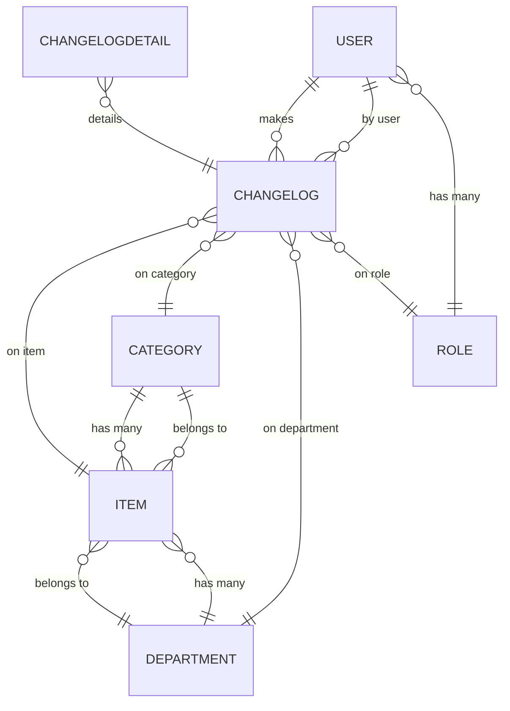

# Inventory Manager – Backend

## Overview

This backend (Node.js, Express, TypeScript, Sequelize) powers the Inventory Manager, providing robust inventory, category, and department management with a relational PostgreSQL database.

## Models & Relations

### Implemented Models

#### **Item**

- `id`: integer, PK, auto-increment
- `name`: string, required
- `quantity`: integer, required, default 1
- `unit`: enum (`und.`, `kg`, `l`, `m`), required, default `und.`
- `creationDate`: datetime, auto
- `updatedOn`: datetime, auto
- `categoryId`: FK to Category, nullable
- `departmentId`: FK to Department, required

#### **Category**

- `id`: integer, PK, auto-increment
- `name`: string, required, unique
- `creationDate`: datetime, auto
- `updatedOn`: datetime, auto

#### **Department**

- `id`: integer, PK, auto-increment
- `name`: string, required, unique
- `creationDate`: datetime, auto
- `updatedOn`: datetime, auto

#### **User**

- `id`: integer, PK, auto-increment
- `username`: string, required, unique
- `passwordHash`: string, required (excluded by default in queries)
- `roles`: many-to-many relationship with Role
- `creationDate`: datetime, auto
- `updatedOn`: datetime, auto
- `deletionDate`: datetime, nullable

#### **Role**

- `id`: integer, PK, auto-increment
- `name`: string, required, unique
- `users`: many-to-many relationship with User
- `creationDate`: datetime, auto
- `updatedOn`: datetime, auto

#### **ChangeLog**

- `id`: integer, PK, auto-increment
- `operation`: enum (`create`, `update`, `delete`, `link`, `unlink`)
- `changeDetails`: JSON, optional
- `changedAt`: datetime, auto
- `changedBy`: FK to User, required

#### **ChangeLogDetail**

- `id`: integer, PK, auto-increment
- `changeLogId`: FK to ChangeLog, required
- `field`: string, required
- `oldValue`: JSON, optional
- `newValue`: JSON, optional
- `metadata`: JSON, optional
- `diffType`: enum (`added`, `changed`, `removed`), required

### Relations

- **Item** belongs to **Category** (nullable)
- **Item** belongs to **Department** (required)
- **Category** has many **Items**
- **Department** has many **Items**
- **User** has many **ChangeLogs**
- **Role** has many **Users** (many-to-many)
- **ChangeLog** belongs to **User**, **Item**, **Category**, **Department**, **Role**
- **ChangeLogDetail** belongs to **ChangeLog**

## ERD Diagram

