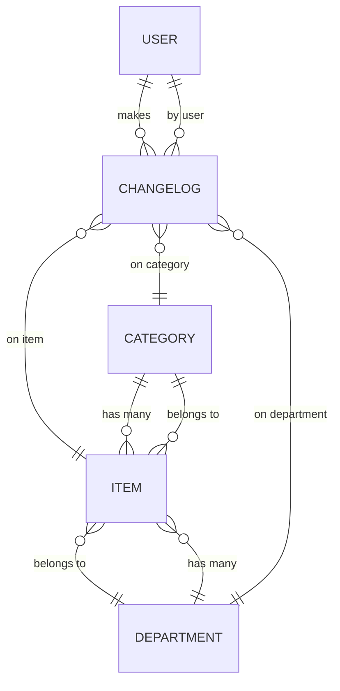

# Inventory Manager – Backend

## Overview

This backend (Node.js, Express, TypeScript, Sequelize) powers the Inventory Manager, providing robust inventory, category, and department management with a relational PostgreSQL database.

## Models & Relations

### Implemented Models

#### **Item**

- `id`: integer, PK, auto-increment
- `name`: string, required
- `quantity`: integer, required, default 1
- `unit`: enum (`und.`, `kg`, `l`, `m`), required, default `und.`
- `creationDate`: datetime, auto
- `updatedOn`: datetime, auto
- `categoryId`: FK to Category, nullable
- `departmentId`: FK to Department, required

#### **Category**

- `id`: integer, PK, auto-increment
- `name`: string, required, unique
- `creationDate`: datetime, auto
- `updatedOn`: datetime, auto

#### **Department**

- `id`: integer, PK, auto-increment
- `name`: string, required, unique
- `creationDate`: datetime, auto
- `updatedOn`: datetime, auto

### Relations

- **Item** belongs to **Category** (nullable)
- **Item** belongs to **Department** (required)
- **Category** has many **Items**
- **Department** has many **Items**

---

### Planned Models

#### **User**

- `id`, `username`, `password_hash`, `role`, timestamps

#### **ChangeLog**

- `id`, `table_name`, `record_id`, `operation`, `changed_by`, `changed_at`, `change_details`

---

## ERD Diagram

