# Inventory Manager – Backend

## Overview

This backend is a comprehensive inventory management system built with **Node.js**, **Express**, **TypeScript**, and **Sequelize ORM**. It provides robust inventory, category, and department management with a relational database (PostgreSQL for production, SQLite for testing), featuring role-based access control (RBAC), JWT authentication, and comprehensive audit logging.

### Key Features

- **Complete CRUD Operations** for inventory items, categories, departments, users, roles, and permissions
- **Role-Based Access Control (RBAC)** with 32 auto-generated permissions
- **JWT Authentication** with bcrypt password hashing
- **Comprehensive Audit Logging** with field-level change tracking
- **Multi-Database Support** (PostgreSQL/SQLite)
- **RESTful API** with pagination, filtering, and sorting
- **Comprehensive Test Coverage** with Jest
- **TypeScript** for type safety and better development experience

### Technology Stack

**Core Dependencies:**

- **Node.js** with **Express** framework
- **TypeScript** for type safety
- **Sequelize** with **sequelize-typescript** for ORM
- **PostgreSQL** (production) / **SQLite** (testing)
- **JWT** for authentication
- **bcrypt** for password hashing
- **CORS** for cross-origin resource sharing

**Development Tools:**

- **Jest** for testing with **ts-jest**
- **ESLint** with TypeScript support
- **Prettier** for code formatting
- **ts-node-dev** for development hot reload
- **Supertest** for API testing

## Installation & Setup

### Prerequisites

- **Node.js** (v16 or higher)
- **Yarn** package manager
- **PostgreSQL** (for production) or **SQLite** (for testing)

### Environment Variables

Create a `.env` file in the backend directory with the following variables:

```env
# Database Configuration
DB_DIALECT=postgres          # or 'sqlite' for testing
DB_HOST=localhost
DB_PORT=5432
DB_NAME=inventory_manager
DB_USER=your_username
DB_PASSWORD=your_password
DB_STORAGE=:memory:          # Only for SQLite testing

# JWT Configuration
JWT_SECRET=your-super-secret-jwt-key
JWT_EXPIRE_TIME=1h           # Token expiration time

# Server Configuration
PORT=4000
BASE_URL=localhost
CORS_ORIGIN=http://localhost:3000

# Environment
NODE_ENV=development         # or 'production' or 'test'
```

### Installation Steps

1. **Install dependencies:**

   ```bash
   yarn install
   ```

2. **Set up your database** (PostgreSQL for production)

3. **Populate the database with admin user and permissions:**

   ```bash
   yarn db:populate
   ```

4. **Start the development server:**
   ```bash
   yarn dev
   ```

The server will start at `http://localhost:4000` (or your configured PORT).

## Available Scripts

- **`yarn dev`** - Start development server with hot reload using ts-node-dev
- **`yarn start`** - Start production server
- **`yarn db:populate`** - Seed database with admin user and all permissions
- **`yarn db:clear`** - Clear all data from the database
- **`yarn test`** - Run Jest test suite with verbose output
- **`yarn lint`** - Run ESLint with auto-fix for TypeScript files

## Database Models & Schema

### Main Models

#### **User**

- `id`: integer, PK, auto-increment
- `username`: string, required, unique
- `passwordHash`: string, required (bcrypt hashed, excluded from queries by default)
- `creationDate`: datetime, auto
- `updatedOn`: datetime, auto
- `deletionDate`: datetime, nullable (soft delete)
- **Relationships**: Many-to-many with Role via UserRole
- **Hooks**: Password hashing before save, automatic change logging

#### **Role**

- `id`: integer, PK, auto-increment
- `name`: string, required, unique
- `description`: string, optional
- `creationDate`: datetime, auto
- `updatedOn`: datetime, auto
- `deletionDate`: datetime, nullable (soft delete)
- **Relationships**: Many-to-many with User and Permission
- **Hooks**: Prevents deletion if users are assigned, automatic change logging

#### **Permission**

- `id`: integer, PK, auto-increment
- `name`: string, required, unique
- `description`: string, required
- `deletionDate`: datetime, nullable (soft delete)
- **Relationships**: Many-to-many with Role via RolePermission
- **Auto-Generated**: 32 permissions (create/get/edit/delete for each entity)

#### **Item**

- `id`: integer, PK, auto-increment
- `name`: string, required, unique
- `quantity`: integer, required, default 1, min 1
- `unit`: enum (`und.`, `kg`, `l`, `m`), required, default `und.`
- `creationDate`: datetime, auto
- `updatedOn`: datetime, auto
- `deletionDate`: datetime, nullable (soft delete)
- `categoryId`: FK to Category, nullable
- `departmentId`: FK to Department, required
- **Relationships**: Belongs to Category (optional) and Department (required)
- **Hooks**: Automatic change logging on all operations

#### **Category**

- `id`: integer, PK, auto-increment
- `name`: string, required, unique
- `creationDate`: datetime, auto
- `updatedOn`: datetime, auto
- `deletionDate`: datetime, nullable (soft delete)
- **Relationships**: Has many Items
- **Hooks**: Prevents deletion if items are assigned, automatic change logging

#### **Department**

- `id`: integer, PK, auto-increment
- `name`: string, required, unique
- `creationDate`: datetime, auto
- `updatedOn`: datetime, auto
- `deletionDate`: datetime, nullable (soft delete)
- **Relationships**: Has many Items
- **Hooks**: Prevents deletion if items are assigned, automatic change logging

#### **ChangeLog**

- `id`: integer, PK, auto-increment
- `operation`: enum (`create`, `update`, `delete`, `link`, `unlink`)
- `changeDetails`: JSONB, optional (additional metadata)
- `changedAt`: datetime, auto
- `changedBy`: FK to User, required
- **Polymorphic Associations**: Can belong to User, Item, Category, Department, Role, or Permission
- **Validation**: At least one association must be set

#### **ChangeLogDetail**

- `id`: integer, PK, auto-increment
- `changeLogId`: FK to ChangeLog, required
- `field`: string, required (field name that changed)
- `oldValue`: JSONB, optional (previous value)
- `newValue`: JSONB, optional (new value)
- `metadata`: JSONB, optional (additional context)
- `diffType`: enum (`added`, `changed`, `removed`), required

### Join Models (Many-to-Many)

#### **UserRole**

- `userId`: FK to User
- `roleId`: FK to Role
- **Hooks**: Automatic link/unlink logging for audit trail

#### **RolePermission**

- `roleId`: FK to Role
- `permissionId`: FK to Permission
- **Hooks**: Automatic link/unlink logging for audit trail

### Entity Relationships

```mermaid
erDiagram
    USER {
        int id PK
        string username UK
        string passwordHash
        datetime creationDate
        datetime updatedOn
        datetime deletionDate
    }

    ROLE {
        int id PK
        string name UK
        string description
        datetime creationDate
        datetime updatedOn
        datetime deletionDate
    }

    PERMISSION {
        int id PK
        string name UK
        string description
        datetime deletionDate
    }

    ITEM {
        int id PK
        string name UK
        int quantity
        enum unit
        datetime creationDate
        datetime updatedOn
        datetime deletionDate
        int categoryId FK
        int departmentId FK
    }

    CATEGORY {
        int id PK
        string name UK
        datetime creationDate
        datetime updatedOn
        datetime deletionDate
    }

    DEPARTMENT {
        int id PK
        string name UK
        datetime creationDate
        datetime updatedOn
        datetime deletionDate
    }

    CHANGELOG {
        int id PK
        enum operation
        jsonb changeDetails
        datetime changedAt
        int changedBy FK
        int userId FK
        int itemId FK
        int categoryId FK
        int departmentId FK
        int roleId FK
        int permissionId FK
    }

    CHANGELOGDETAIL {
        int id PK
        int changeLogId FK
        string field
        jsonb oldValue
        jsonb newValue
        jsonb metadata
        enum diffType
    }

    USERROLE {
        int userId FK
        int roleId FK
    }

    ROLEPERMISSION {
        int roleId FK
        int permissionId FK
    }

    %% Many-to-Many Relationships
    USER ||--o{ USERROLE : "has roles"
    ROLE ||--o{ USERROLE : "assigned to users"
    ROLE ||--o{ ROLEPERMISSION : "has permissions"
    PERMISSION ||--o{ ROLEPERMISSION : "granted to roles"

    %% One-to-Many Relationships
    CATEGORY ||--o{ ITEM : "contains"
    DEPARTMENT ||--|| ITEM : "manages"
    USER ||--o{ CHANGELOG : "creates"
    CHANGELOG ||--o{ CHANGELOGDETAIL : "details"

    %% Polymorphic Relationships (ChangeLog can reference any entity)
    USER ||--o{ CHANGELOG : "logs changes to"
    ITEM ||--o{ CHANGELOG : "logs changes to"
    CATEGORY ||--o{ CHANGELOG : "logs changes to"
    DEPARTMENT ||--o{ CHANGELOG : "logs changes to"
    ROLE ||--o{ CHANGELOG : "logs changes to"
    PERMISSION ||--o{ CHANGELOG : "logs changes to"
```



**Relationship Details:**

- **User** ↔ **Role** (many-to-many via UserRole join table)
- **Role** ↔ **Permission** (many-to-many via RolePermission join table)
- **Item** → **Category** (many-to-one, optional - items can exist without category)
- **Item** → **Department** (many-to-one, required - every item must belong to a department)
- **ChangeLog** → **User** (many-to-one via changedBy - tracks who made the change)
- **ChangeLog** → **Any Entity** (polymorphic - can reference User, Item, Category, Department, Role, or Permission)
- **ChangeLogDetail** → **ChangeLog** (one-to-many - detailed field-level changes for each log entry)

## Authentication & Authorization

### JWT Authentication

- **Token Generation**: JWT tokens with configurable expiration (default: 1h)
- **Password Security**: bcrypt hashing with salt rounds (default: 10)
- **Token Validation**: Middleware validates tokens on protected routes
- **User Context**: Authenticated user ID available in `req.userId`

### Role-Based Access Control (RBAC)

- **32 Auto-Generated Permissions**: 4 actions × 8 entities
  - Actions: `create`, `get`, `edit`, `delete`
  - Entities: `category`, `changelog`, `changelogdetail`, `department`, `item`, `permission`, `role`, `user`
- **Admin Role**: Created automatically with all permissions
- **Admin User**: Default credentials (username: `admin`, password: `admin`)

### Protected Routes

All routes except `/api/auth/*` require valid JWT token in Authorization header:

```
Authorization: Bearer <your-jwt-token>
```

## API Endpoints

### Authentication Routes (`/api/auth`)

- **`POST /api/auth/login`** - User login with username/password
- **`GET /api/auth/validate`** - Validate JWT token
- **`GET /api/auth/me`** - Get current user information with roles and permissions

### Protected Routes (Require Authentication)

- **`/api/users`** - User management (CRUD operations)
- **`/api/roles`** - Role management with permission assignment
- **`/api/permissions`** - Permission listing and management
- **`/api/items`** - Inventory item management
- **`/api/categories`** - Category management
- **`/api/departments`** - Department management

### Common Features

- **Pagination**: `?page=1&pageSize=10`
- **Filtering**: Entity-specific filters (e.g., `?name=search&department=IT`)
- **Sorting**: `?sortBy=name&sortOrder=ASC`
- **Error Handling**: Consistent JSON error responses
- **Validation**: Request body validation with detailed error messages

## Audit Logging System

### Comprehensive Change Tracking

- **Automatic Logging**: All CRUD operations logged via Sequelize hooks
- **Field-Level Details**: Track old and new values for each changed field
- **Operation Types**: `create`, `update`, `delete`, `link`, `unlink`
- **User Attribution**: Every change linked to the user who made it
- **Polymorphic Design**: Single ChangeLog table for all entities

### Change Log Features

- **Password Obfuscation**: Password fields shown as `************` in logs
- **Join Table Support**: Link/unlink operations for many-to-many relationships
- **Transaction Support**: Consistent logging within database transactions
- **Metadata Storage**: Additional context stored in JSONB fields

### Accessing Change Logs

Change logs are included in entity queries and can be filtered by:

- Entity type (User, Item, Category, etc.)
- Operation type (create, update, delete, link, unlink)
- Date range
- User who made the change

## Database Configuration

### Multi-Database Support

- **PostgreSQL**: Production database with JSONB support
- **SQLite**: Testing database with in-memory option
- **Environment-Based**: Automatic configuration via environment variables

### Database Operations

- **Auto-Sync**: Sequelize automatically creates/updates tables
- **Soft Deletes**: Most entities use `deletionDate` for soft deletion
- **Constraints**: Foreign key constraints with CASCADE/RESTRICT policies
- **Indexes**: Automatic indexing on primary keys and foreign keys

## Testing

### Test Coverage

Comprehensive test suite covering:

- **Model Tests**: Validation, relationships, hooks
- **Controller Tests**: Business logic, error handling
- **Route Tests**: API endpoints, authentication, authorization
- **Integration Tests**: End-to-end workflows
- **Middleware Tests**: Authentication and authorization logic
- **Utility Tests**: Helper functions and services

### Test Configuration

- **Jest**: Test runner with TypeScript support
- **Supertest**: HTTP assertion library for API testing
- **SQLite In-Memory**: Fast, isolated test database
- **Test Environment**: Separate configuration for testing

### Running Tests

```bash
# Run all tests
yarn test

# Run tests in watch mode
yarn test --watch

# Run tests with coverage
yarn test --coverage
```

## Development Tools

### Code Quality

- **TypeScript**: Strict type checking with custom type definitions
- **ESLint**: Linting with TypeScript rules and auto-fix
- **Prettier**: Code formatting with consistent style
- **Import Sorting**: Automatic import organization

### Development Experience

- **Hot Reload**: ts-node-dev for instant server restart on changes
- **Path Mapping**: TypeScript path aliases for clean imports
- **Type Definitions**: Custom types for Express, Sequelize extensions
- **Error Handling**: Comprehensive error types and messages

## Security Features

### Authentication Security

- **bcrypt Hashing**: Secure password storage with configurable salt rounds
- **JWT Tokens**: Stateless authentication with configurable expiration
- **Token Validation**: Middleware validates tokens on every protected request

### Data Security

- **Input Validation**: Sequelize model validation and custom validators
- **SQL Injection Protection**: Parameterized queries via Sequelize ORM
- **CORS Configuration**: Configurable cross-origin resource sharing
- **Environment Variables**: Sensitive data stored in environment variables

### Access Control

- **Role-Based Permissions**: Granular permission system
- **Route Protection**: Authentication middleware on all protected routes
- **User Context**: Authenticated user available throughout request lifecycle

## Error Handling

### Validation Errors

- **Model-Level**: Sequelize decorators for field validation
- **Controller-Level**: Business logic validation with detailed messages
- **Request-Level**: Input validation for API endpoints

### Error Response Format

```json
{
  "error": "Detailed error message",
  "code": "ERROR_CODE",
  "details": {
    "field": "Additional context"
  }
}
```

### Transaction Support

- **Data Integrity**: Critical operations wrapped in database transactions
- **Rollback**: Automatic rollback on errors
- **Audit Consistency**: Change logs created within same transaction

## Default Admin Account

After running `yarn db:populate`, you can log in with:

- **Username**: `admin`
- **Password**: `admin`

**⚠️ Important**: Change the admin password immediately in production!

## License

MIT License - see package.json for details.

---

## Contributing

1. Fork the repository
2. Create a feature branch
3. Make your changes with tests
4. Run `yarn lint` and `yarn test`
5. Submit a pull request

For questions or issues, please create an issue in the repository.
